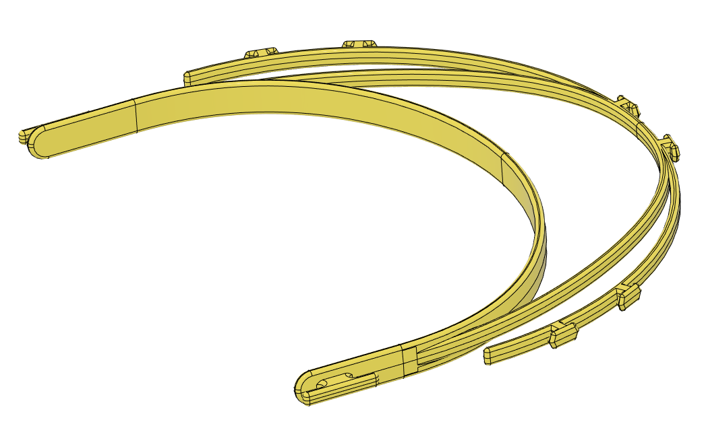
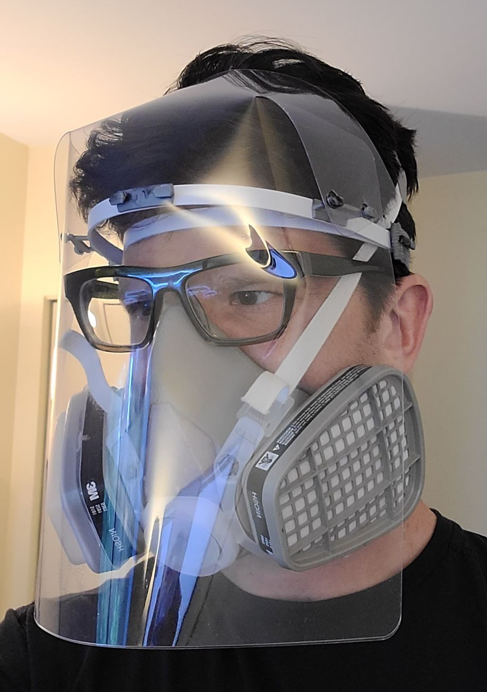

# Injection Molded Face Shield Frame

This is a remix of the frame from here: https://github.com/mrjonny2/PNWS. It has only a few changes, designed to make
it easier to injection mold the entire frame.

* The head band is thicker to make it easier to fill
* The head band is symetric between the mold halves (the original design was not to ease 3D printing)
* It has 3 degrees of draft everyone except for where the face band touches you forehead
* The molds can be cut with 1/16" end mills for faster production of molds (no EDM required)

This is part of a collborate effort by teh Washington State 3D Face Shield Hub on Facebook: https://www.facebook.com/groups/209781503693623/

This frame is best used with the "origami" shield developed by the PNWS group:

[Origami Shield](https://github.com/mrjonny2/PNWS/tree/master/128827-02%20FABRICATION%20PACKAGE/128839%20FACESHIELD%20ORIGAMI%20PNWS)

